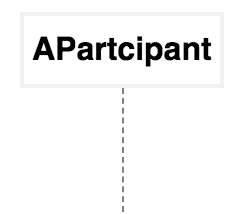
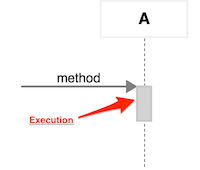
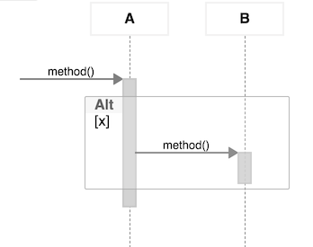
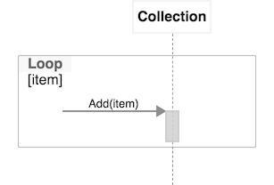

This page is an overview of the ZenUML documentation and related resources.

It is under construction.

UML sequence diagram is model the flow of logic within a system. It is commonly used
for both analysis and design purpose. It is also used to analyze legacy code.

## Sequence Diagram notions
Sequence diagram is structured in a way that it represents a time-line of activities. 
Each `participant` has a column and the message exchanged between them are represented
by arrows.

### Lifeline

**Lifeline** represents an individual **participant** in the interaction.

In ZenUML, to declare a `participant`, you simply type in the name of it, such as 
`AParticipant` at the beginning.



```js
AParticipant
```

### Execution

**Execution** represents a period in the participant's lifetime. It is the bar placed on the lifeline.

In ZenUML, an execution is automatically created when you call a method on a participant.



```js
A.method()
```
### Alternatives

**Alternatives** represents a choice or alternatives of behaviour. At most one of the operands will be chose.
 
In ZenUML, to create an alternative fragment, you simply use your familiar keywords `if/else`.



```js
if(x) { 
  A.method() 
}
```

### Loop

**Loop** represents a repeated execution.

In ZenUML, to create a loop fragment, you can choose one of `for`, `foreach`, `forEach` and `while`.



```js
forEach(item) { 
  Collection.Add(item) 
}
```
